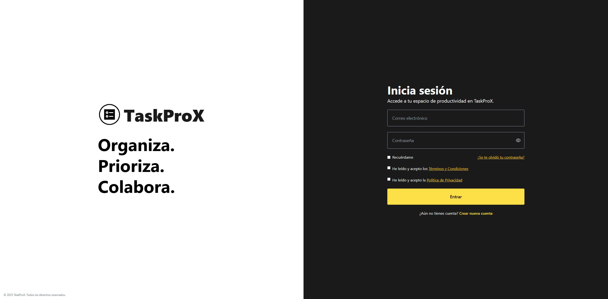
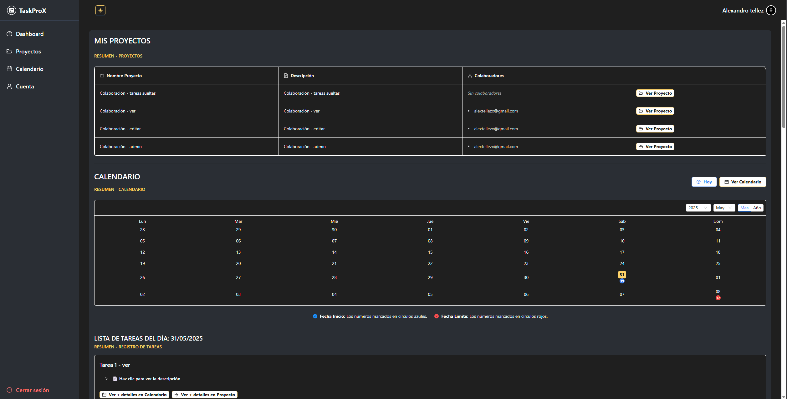
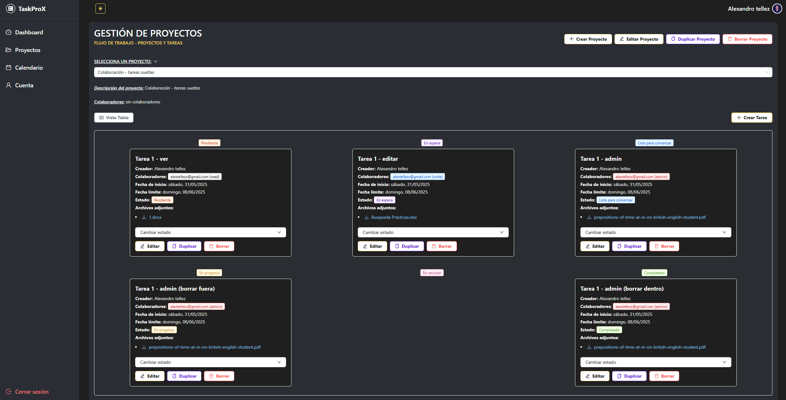
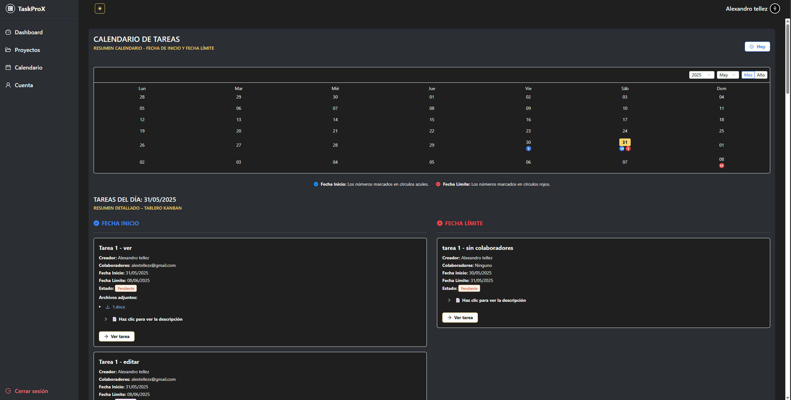
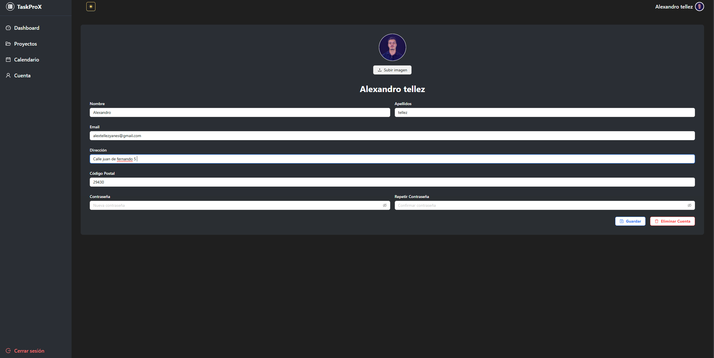

# ☑️TaskProX 

**TaskProX** is a modern and collaborative task and project management web application. Built with FastAPI, MongoDB, React, TailwindCSS, and Ant Design, it provides teams and individuals with an intuitive platform to organize projects, manage tasks, assign roles, set deadlines, and work efficiently—whether solo or with collaborators.

---

## 🚀 Features

- ✅ User authentication with JWT (Login, Register, Forgot/Reset Password).
- 🗂️ Project management (Create, update, delete, assign collaborators with permissions).
- 📝 Task management (CRUD, assign users, file attachments, description editor).
- 📆 Calendar view with visual task indicators (start & deadline dates).
- 🧩 Kanban board with task columns by status.
- 🔐 Granular permission system:
  - `read`: View only.
  - `write`: View & edit.
  - `admin`: Full control (edit, delete).
- 🌗 Dark and light mode switch.
- 📦 File uploads (PDF, Word, Excel, Images) with download support.
- 🔍 Task filtering by status, dates, and collaborators.
- 📱 Fully responsive design (Desktop, Tablet, Mobile).

---

## 🛠️ Tech Stack

### Backend
- **FastAPI** – Python web framework.
- **MongoDB Atlas** – Cloud NoSQL database.
- **Pydantic** – Data validation.
- **JWT** – Token-based authentication.
- **aiosmtplib** – Async email for password reset.

### Frontend
- **React** – UI library.
- **Vite** – Fast bundler and development server.
- **TailwindCSS** – Utility-first CSS framework.
- **Ant Design** – UI components.
- **React Router** – Client-side routing.
- **React Quill** – Rich text editor.

---

## ⚙️ Local Setup

### 1. Clone the repository

```
git clone https://github.com/AlexandroTellez/TaskProX.git
cd TaskProX
```

### 2. Backend Setup

```
cd backend
python -m venv venv
source venv/bin/activate  # or venv\Scripts\activate on Windows
pip install -r requirements.txt
```
- Create a .env file and configure:

```.env
ENV=development
MONGO_URL=your_mongodb_url
SECRET_KEY=your_jwt_secret
FRONTEND_URL=http://localhost:5173
EMAIL_FROM=your_email@gmail.com
EMAIL_PASSWORD=your_email_app_password
SMTP_HOST=smtp.gmail.com
SMTP_PORT=587
```
Run backend:
```
uvicorn main:app --reload
```

### 3. Frontend Setup
```
cd client
npm install
npm run dev
```
---

## 🌐 Deployment

- Frontend: Vercel → [task-pro-x.vercel.app](https://task-pro-x.vercel.app).

- **Backend**: Deployed on **Render** (in this project), but any FastAPI-compatible hosting with HTTPS will work.
  
---
## 👤 User Roles & Permissions

| Feature        | Creator | Admin | Writer | Reader |
| -------------- | :-----: | :---: | :----: | :----: |
| View Project   |    ✅    |   ✅   |    ✅   |    ✅   |
| Duplicate Tasks   |    ✅    |   ✅   |    ✅   |    ✅  |
| Edit Project   |    ✅    |   ✅   |    ✅   |    ❌   |
| Delete Project |    ✅    |   ✅   |    ❌   |    ❌   |
| View Tasks     |    ✅    |   ✅   |    ✅   |    ✅   |
| Edit Tasks     |    ✅    |   ✅   |    ✅   |    ❌   |
| Delete Tasks   |    ✅    |   ✅   |    ❌   |    ❌   |

---
## 📸 Screenshots

### 🔐 Login 


### 📊 Dashboard (Dark Mode)


### 📋 Project View – Table (Dark Mode)


### 🧩 Project View – Kanban (Dark Mode)


### 📆 Calendar (Dark Mode)


---
### 👤 Account Settings (Dark Mode)

---
## 📄 License
- This project is licensed under the MIT License.
---
### 6. Contact me 👨‍💻

* **Author**: Alexandro Tellez
* **Email**: alextellezyanes@gmail.com
* **LinkedIn**: [Alexandro Tellez](https://www.linkedin.com/in/alex-tellez-y/)
---
